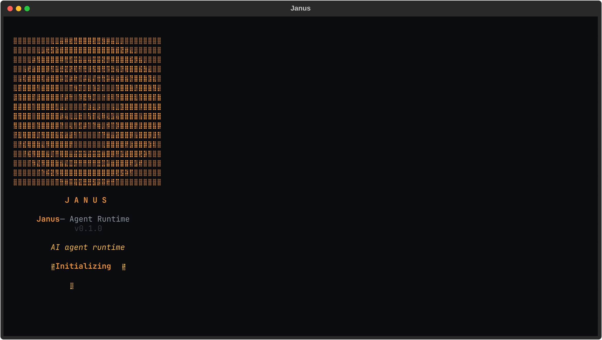
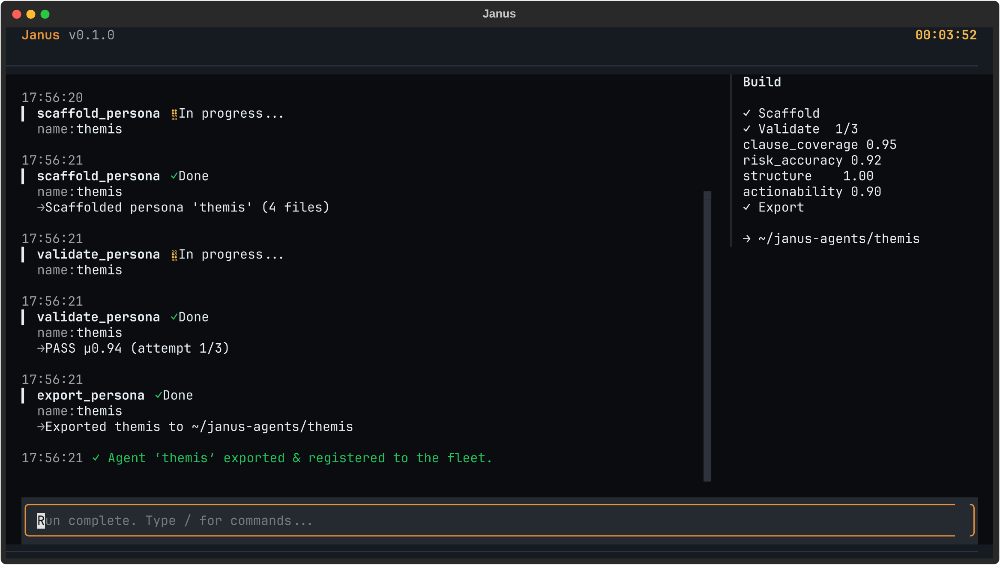

# Janus

**Describe the expert. Janus builds it, tests it, and ships it.**

Janus is a system for building specialized AI agents by describing them in plain
language. You tell it what expert agent you want; it interviews you, builds the
agent, tests that the agent actually works, and hands you a self-contained,
runnable repo.

<p align="center">
  
</p>

## The core idea

Most agent builders hand you a blank canvas and a lot of glue code. Janus is an
agent whose specialty is *making other agents*. That flagship builder is the
**factory** persona.

An agent here is not code — it's a declarative directory: identity, instructions,
tools, output format, and a quality rubric. Defining a new one needs zero code
changes. Every agent it builds inherits the same runtime: five interchangeable
provider backends, a Textual TUI or headless CLI, and a layered validation
harness.

**It fails honestly.** Every agent is validated by a real smoke run plus an LLM
judge scoring its output against a rubric. If an agent can't meet its bar, Janus
exports *nothing* and tells you why, with the scores. The validation fails
closed — a broken or silent judge scores zero.

One command, and you get the whole loop — scaffold, validate against the rubric,
and export a standalone agent:

<p align="center">
  
</p>

Janus Core was extracted from a real, in-production proprietary pentesting agent.
That domain was just the first agent built this way; the template proved itself
on a hard, high-stakes problem before becoming a general-purpose tool. See
[PROVENANCE.md](PROVENANCE.md).

## Install

Requires Python ≥ 3.12. On an externally-managed system (e.g. NixOS) use a venv.

```bash
python -m venv .venv
.venv/bin/pip install -e '.[dev]'      # everything: TUI, art, Claude SDK, test tools
```

Optional extras if you don't want the full `dev` set: `.[tui]` (Textual UI),
`.[art]` (Pillow, for banner art), `.[claude-sdk]` (Claude Agent SDK backend).
The base package runs headless without any of them.

Installing provides a `janus` console script; `python -m janus …` works too.

## Configure a provider

A run needs one LLM backend. Set it via environment variables (a gitignored
`.env` in the repo root is read automatically — see [`.env.example`](.env.example)).
Precedence, **first match wins**:

1. `DS4_URL` → DeepSeek-style endpoint
2. `OPENROUTER_MODEL` (+ `OPENROUTER_API_KEY`) → OpenRouter
3. `LOCAL_MODEL` → local Ollama
4. `USE_CLAUDE_AGENT_SDK=true` → Claude Code / Agent SDK (OAuth)
5. `ANTHROPIC_API_KEY` → native Anthropic API

## Quickstart

Run the zero-setup demo agent — no Docker, no extra tools:

```bash
janus run --persona market_research --task "the market for at-home espresso machines"
```

Then build your own agent by conversation (the factory is the default persona):

```bash
janus run --task "an agent that reviews legal contracts for risky clauses"
```

On a TTY with Textual installed you get the interactive TUI; otherwise Janus
falls back to a headless plaintext renderer automatically.

## Demo agents

Three personas ship with this repository.

| Persona | What it does | Needs |
|---|---|---|
| [`factory`](personas/factory/README.md) | The flagship: interviews you, scaffolds an agent, validates it, exports it. | A provider |
| [`market_research`](personas/market_research/README.md) | Researches a market and emits a structured, sourced brief. The zero-setup on-ramp. | A provider |
| `code_auditor` | Audits a codebase for quality signals using real CLI tools (`rg`, `scc`, `git`) inside its own container. | A provider + Docker |

`code_auditor` demonstrates **containerized agents** — Janus builds the image,
bakes in the command-line tools the agent needs, and runs and validates it in
there. `market_research` remains the path that works with nothing but an API key.

## Command map

| Command | What it does |
|---|---|
| `janus run --persona <p> --task <t>` | Run a persona on a task (`--persona` defaults to `factory`). |
| `janus validate --persona <p>` | Smoke-run + judge a persona against its rubric. |
| `janus export --persona <p> --dest <d>` | Stamp a self-contained vendored agent repo. |
| `janus dashboard` | Interactive fleet dashboard (also `janus fleet` on a TTY). |
| `janus fleet list / status / run / validate` | Inspect and drive registered agents. |
| `janus fleet adopt <path>` | Import an existing exported repo into the fleet. |
| `janus fleet improve <name> "<complaint>"` | Improve an agent in place via the factory. |
| `janus fleet sync [<name>]` | Re-vendor the current runtime into fleet agents. |
| `janus fleet rename <old> <new>` | Rename an agent (dir, manifest, registry, wrappers). |
| `janus fleet remove <name> [--purge --yes]` | Remove an agent (deregister; `--purge` deletes its files). |

Factory-built agents land in the fleet home (`~/janus-agents/`, override with
`JANUS_FLEET_DIR`) and are registered automatically.

## Concepts

- **Persona** — a declarative agent directory: `manifest.toml` + `prompt.md` +
  optional `tools.py` + `output_schema.json` + `rubric.toml` (+ optional
  `banner.txt`). No code changes needed to define a new agent.
- **Validation harness** — a smoke run (boots, runs, emits a schema-valid
  deliverable) plus an LLM judge that scores the deliverable per rubric
  criterion. Fails closed.
- **Export** — a wholesale copy of the `janus/` runtime + the persona + rendered
  wrapper files (`agent.py`, `pyproject.toml`, `Dockerfile`, …), git-initialized.
  The result runs on its own.
- **Fleet** — the registry of managed agents plus commands to run, validate,
  improve, adopt, and **sync** them. `sync` re-vendors core fixes into agents
  that were exported before the fix landed (each agent carries its own runtime
  copy).

## Development

```bash
.venv/bin/python -m pytest              # test suite
.venv/bin/python -m ruff check janus/   # lint (pinned rules: E,F,I,W,UP,B)
```

See [CONTRIBUTING.md](CONTRIBUTING.md) before opening a pull request.

## License & Commercial Use

Janus is **free and open source under the [GNU AGPL-3.0](LICENSE)**. Build with
it, fork it, run it, ship agents with it — the AGPL is a feature, not fine print.

**Most users never need anything else.** In particular:

- **Running Janus** — locally, on your own servers, or internally — carries
  **no source-sharing obligation**.
- **Agents you build stay yours.** Under the [persona exception](LICENSE-EXCEPTION),
  the personas you author and the output your agents produce are **not** subject
  to the AGPL — even though each exported agent bundles the runtime. Your prompts,
  tools, and results remain proprietary.

**You need a commercial license if you want to:**

- **Embed a modified Janus engine in a closed-source product** you distribute,
  without releasing your engine changes under the AGPL.
- **Offer Janus (or a modified version) as a hosted/SaaS service** without making
  your modified source available to your users, as AGPL §13 requires.
- **Adopt Janus where AGPL is disallowed** by your organization's policy.

A commercial license lifts the AGPL's copyleft obligations for your use, under
terms we agree on — no obligation to open your modifications.

**→ Talk to us:** [contact@pantheosforge.com](mailto:contact@pantheosforge.com)

Pantheos Forge also builds and operates **production expert agents** on this
exact engine — including **Apophis**, our security agent — and offers
agent-development consulting. If you'd rather have the expert built for you than
build it yourself, [get in touch](mailto:contact@pantheosforge.com).

---

AGPL-3.0. See [LICENSE](LICENSE) and [LICENSE-EXCEPTION](LICENSE-EXCEPTION).
Trademarks: see [TRADEMARK.md](TRADEMARK.md).

**Source offer (AGPL §13).** This repository *is* the corresponding source for
the Janus engine. If you run a modified version of Janus over a network, you must
offer your users the source of your modified version under the AGPL.
